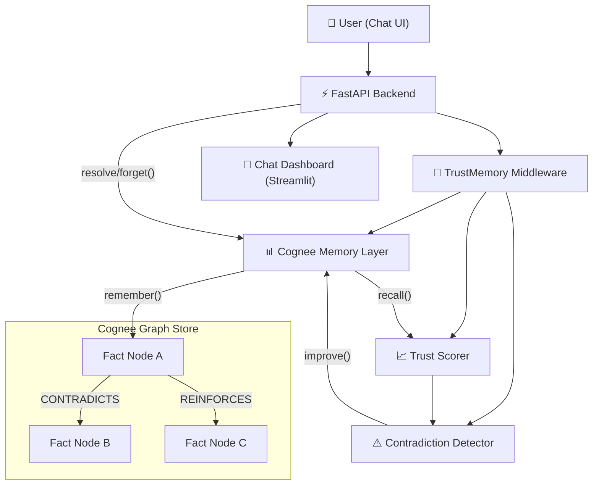
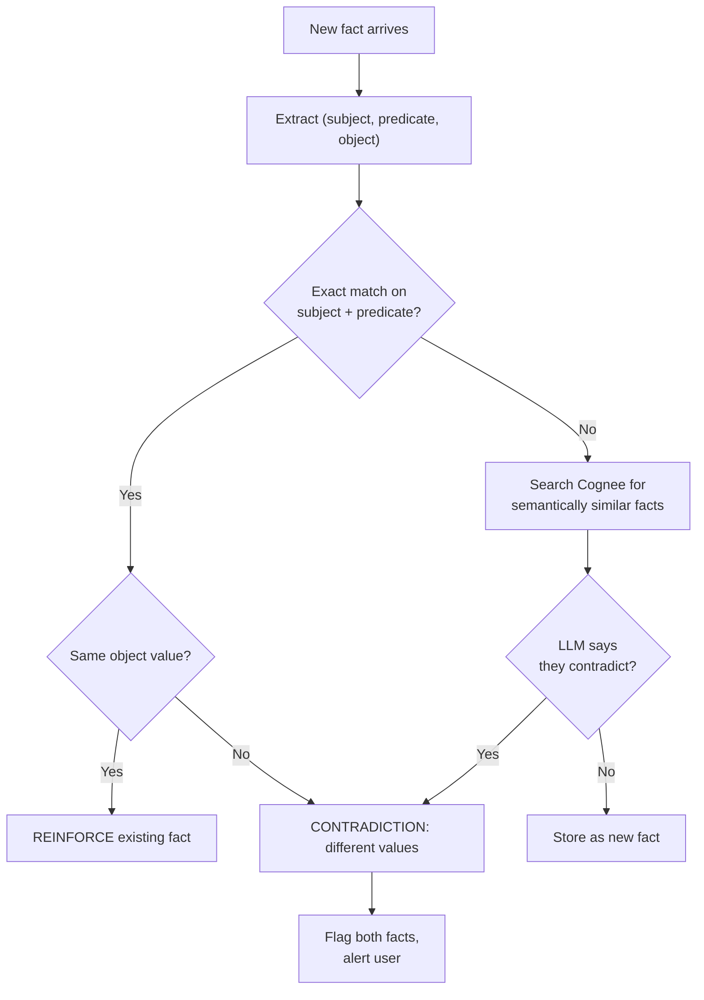

# TrustGraph — A Self-Doubting Memory Layer for AI Agents

> **Hackathon:** The Hangover Part AI (WeMakeDevs) · Jun 29 – Jul 5, 2026
> **Deadline:** July 5 · **Today:** July 2 · **Time left:** ~3 days

## The Elevator Pitch

*"Every AI assistant silently overwrites old facts. TrustGraph doesn't. It scores every memory's trustworthiness, detects contradictions in real-time, and asks YOU to decide — instead of quietly forgetting what you told it last week."*

---

## Why This Wins (Mapped to Judging Criteria)

| Criterion | How TrustGraph nails it |
|---|---|
| **Potential Impact** | Every AI assistant (ChatGPT, Copilot, Claude) silently overwrites old facts — this is the #1 UX trust killer |
| **Creativity** | "Self-doubting AI" — nobody else is building agents that *question their own memory* |
| **Technical Excellence** | Custom trust-scoring engine + graph-traversal contradiction detection + temporal decay |
| **Best Use of Cognee** | Deep use of ALL four lifecycle verbs: `remember()`, `recall()`, `improve()`, `forget()` in the trust lifecycle |
| **User Experience** | Users see transparency — contradictions surfaced, trust scores visible, no black-box answers |
| **Presentation Quality** | Live demo: tell the agent conflicting facts, watch it flag contradictions and ask for resolution |

---

## Architecture Overview



---

## Core Mechanism: The Trust Lifecycle

Every fact flows through this lifecycle:

```
1. INGEST   → remember() with trust metadata (timestamp, source, reinforcement_count=0)
2. RECALL   → recall() wraps results with trust_score + contradiction check
3. REINFORCE → Same fact repeated → improve() bumps reinforcement_count, raises trust
4. CONTRADICT → Conflicting fact detected → both facts flagged, user prompted
5. RESOLVE  → User picks the truth → forget() the wrong one, improve() the winner
6. DECAY    → Old unreinforced facts lose trust over time (temporal decay)
```

---

## Proposed Implementation (3-Day Sprint)

### Day 1 (Jul 2-3): Core Engine — Trust Scoring + Contradiction Detection

---

#### [NEW] `trustgraph/__init__.py`
- Package init, version info.

---

#### [NEW] `trustgraph/models.py`
- Pydantic models for the trust system.

```python
from pydantic import BaseModel, Field
from datetime import datetime
from typing import Optional
from enum import Enum

class FactStatus(str, Enum):
    ACTIVE = "active"
    CONTRADICTED = "contradicted"
    RESOLVED = "resolved"
    DECAYED = "decayed"

class TrustMetadata(BaseModel):
    """Metadata attached to every fact stored in memory."""
    fact_id: str                          # UUID
    original_text: str                    # The raw user input
    normalized_text: str                  # LLM-extracted canonical fact
    subject: str                          # Entity this fact is about
    predicate: str                        # Relationship type (e.g., "deadline_is")
    object_value: str                     # The value (e.g., "Friday")
    timestamp: datetime = Field(default_factory=datetime.utcnow)
    reinforcement_count: int = 0          # How many times this fact was repeated
    source: str = "user"                  # "user", "system", "inferred"
    status: FactStatus = FactStatus.ACTIVE
    contradiction_group: Optional[str] = None  # Links contradicting facts

class TrustScore(BaseModel):
    """Computed trust score for a fact."""
    fact_id: str
    score: float                          # 0.0 to 1.0
    recency_component: float              # Higher = more recent
    reinforcement_component: float        # Higher = more confirmed
    consistency_component: float          # Lower if contradictions exist
    reasoning: str                        # Human-readable explanation

class ContradictionPair(BaseModel):
    """A detected contradiction between two facts."""
    fact_a: TrustMetadata
    fact_b: TrustMetadata
    trust_a: float
    trust_b: float
    subject: str
    predicate: str
    explanation: str                      # LLM-generated explanation
    resolved: bool = False
    winner_id: Optional[str] = None
```

---

#### [NEW] `trustgraph/fact_extractor.py`
- Uses the LLM (via Cognee's configured provider) to extract structured facts from free-text user input.

```python
async def extract_facts(user_text: str) -> list[dict]:
    """
    Given user text like "My deadline is Friday",
    extract structured facts:
    [{"subject": "deadline", "predicate": "is", "object": "Friday"}]

    Uses Cognee's configured LLM via litellm under the hood.
    """
```

> [!TIP]
> This is the key intelligence layer — it normalizes messy user input into comparable (subject, predicate, object) triples so we can detect when two facts conflict on the same subject+predicate.

---

#### [NEW] `trustgraph/trust_scorer.py`
- The core trust-scoring engine. Computes a composite score for each fact.

**Trust Formula:**
```
trust_score = (
    w_recency    * recency_score(timestamp) +
    w_reinforce  * reinforcement_score(count) +
    w_consistency * consistency_score(contradictions)
)

where:
    recency_score     = exp(-λ * days_since_stored)     # Exponential decay
    reinforcement_score = 1 - exp(-α * reinforce_count) # Diminishing returns
    consistency_score = 1.0 if no contradictions, 0.5 if contradicted

    w_recency = 0.4, w_reinforce = 0.35, w_consistency = 0.25
    λ = 0.1 (half-life ~7 days), α = 0.5
```

> [!IMPORTANT]
> The weights and decay constants are configurable. The defaults are tuned for a "personal assistant" use case where recent info matters most, but users can tune for "knowledge base" mode where reinforcement matters more.

---

#### [NEW] `trustgraph/contradiction_detector.py`
- Detects contradictions by comparing incoming facts against existing facts with the same (subject, predicate).

**Two-stage detection:**
1. **Exact match** — Same subject + predicate but different object → definite contradiction
2. **Semantic match** — Use Cognee's vector search (`SearchType.CHUNKS`) to find semantically similar facts, then ask LLM if they contradict

```python
async def detect_contradictions(
    new_fact: TrustMetadata,
    existing_facts: list[TrustMetadata],
) -> list[ContradictionPair]:
    """
    Compare new_fact against all existing facts.
    Returns list of contradiction pairs found.
    """
```

---

#### [NEW] `trustgraph/trust_memory.py`
- The main middleware class that wraps Cognee's API with trust-aware behavior.

```python
class TrustMemory:
    """Trust-aware memory layer wrapping Cognee."""

    async def store(self, text: str, source: str = "user") -> StoreResult:
        """
        1. Extract facts from text via LLM
        2. Check for contradictions against existing memory
        3. Store via cognee.remember() with trust metadata
        4. Return: stored facts + any contradictions found
        """

    async def query(self, query_text: str) -> QueryResult:
        """
        1. cognee.recall() to get relevant memories
        2. Compute trust scores for each result
        3. Check for active contradictions
        4. Return ranked results with trust scores + contradiction warnings
        """

    async def reinforce(self, fact_id: str) -> None:
        """Bump reinforcement count for a fact. Uses cognee.improve()."""

    async def resolve_contradiction(
        self, contradiction_id: str, winner_id: str
    ) -> None:
        """
        User resolves a contradiction by picking the winner.
        - Winner: reinforcement_count += 1, status = ACTIVE
        - Loser: cognee.forget() to remove from memory
        """

    async def decay_check(self) -> list[str]:
        """
        Scan all facts, compute trust scores.
        Facts below threshold (0.15) get status = DECAYED.
        Returns list of decayed fact IDs.
        """
```

---

### Day 2 (Jul 3-4): FastAPI Backend + Streamlit Chat UI

---

#### [NEW] `trustgraph/api.py` — FastAPI Backend

```python
from fastapi import FastAPI
from fastapi.middleware.cors import CORSMiddleware

app = FastAPI(title="TrustGraph", version="1.0.0")

# Endpoints:
# POST /api/store         — Store a new fact (text input)
# POST /api/query         — Query memory with trust-scored results
# GET  /api/facts         — List all stored facts with trust scores
# GET  /api/contradictions — List all active (unresolved) contradictions
# POST /api/resolve       — Resolve a contradiction (pick winner)
# POST /api/reinforce     — Reinforce a fact (bump trust)
# POST /api/decay         — Trigger decay check manually
# POST /api/reset         — Reset all memory (cognee.forget(everything=True))
# GET  /api/graph         — Get graph data for visualization
```

---

#### [NEW] `trustgraph/chat_app.py` — Streamlit Chat UI

> [!IMPORTANT]
> Using **Streamlit** instead of React for speed — it's a hackathon. Streamlit gives us a polished chat interface in ~200 lines vs. 2000 for React.

**Key UI Components:**

1. **Chat Interface** — Standard chat bubbles (user ↔ agent)
2. **Trust Badges** — Each agent response shows trust score as a colored badge:
   - 🟢 `0.8-1.0` High confidence
   - 🟡 `0.5-0.79` Medium confidence
   - 🔴 `0.0-0.49` Low confidence
3. **Contradiction Alert** — When contradictions are detected, a prominent warning card appears:
   ```
   ⚠️ CONTRADICTION DETECTED
   → "Deadline is Friday" (trust: 0.43, stored 3 days ago)
   → "Deadline is Wednesday" (trust: 0.87, stored today)
   [Keep Friday] [Keep Wednesday] [Keep Both]
   ```
4. **Memory Inspector Panel** (sidebar) — Expandable panel showing:
   - All stored facts with trust scores
   - Timeline visualization of when facts were stored
   - Active contradictions count
   - Decayed facts count
5. **Trust Score Breakdown** — Click any fact to see the math:
   ```
   Recency:      0.92 (stored 2h ago)
   Reinforcement: 0.39 (confirmed 1x)
   Consistency:   1.00 (no contradictions)
   ─────────────────────
   Total:         0.79
   ```

---

### Day 3 (Jul 4-5): Polish, Demo, Integration

---

#### [MODIFY] Polish & Integration
- End-to-end testing with real conversation flows
- Add loading states, error handling, smooth transitions
- Edge cases: rapid contradictions, self-contradicting single messages, partial contradictions
- Export `cognee.visualize_graph()` for the knowledge graph view

---

#### [NEW] `trustgraph/prompts.py`
- All LLM prompts in one place:
  - Fact extraction prompt
  - Contradiction detection prompt
  - Trust-aware response generation prompt (wraps recall results with trust context)

---

#### Demo Script (5-Minute Pitch)

1. **Hook (30s):** *"Ask ChatGPT what your deadline is on Monday. Then tell it the deadline changed on Wednesday. Ask again on Thursday. It'll say Wednesday. But what if Monday's answer was right? Every AI assistant silently overwrites. TrustGraph doesn't."*

2. **Live Demo (120s):**
   ```
   User: "My project deadline is next Friday"
   Agent: ✅ Stored. Trust: 1.0

   User: "My team has 5 members"
   Agent: ✅ Stored. Trust: 1.0

   User: "Actually the deadline is Wednesday"
   Agent: ⚠️ CONTRADICTION DETECTED
         → "Deadline is Friday" (trust: 0.43)
         → "Deadline is Wednesday" (trust: 0.87)
         Which is correct?

   User: [clicks "Keep Wednesday"]
   Agent: ✅ Resolved. "Deadline is Wednesday" (trust: 0.95)
         "Deadline is Friday" has been forgotten.

   User: "The deadline is Wednesday"  (says it again)
   Agent: ✅ Reinforced. Trust: 0.97 (+0.02)

   User: "What's my deadline?"
   Agent: "Your deadline is Wednesday"
         🟢 Trust: 0.97 | Reinforced 1x | No contradictions
   ```

3. **Show Memory Inspector (60s):** Open sidebar → show all facts, trust scores, the resolved contradiction history, the decay curve over time.

4. **Close (30s):** *"TrustGraph doesn't just remember — it doubts, questions, and learns. That's not RAG with extra steps. That's trust."*

---

## Cognee Memory Lifecycle Mapping

| Cognee Verb | TrustGraph Usage | Why it's not bolt-on |
|---|---|---|
| `remember()` | Store facts with trust metadata as structured text | Every fact gets timestamp + reinforcement count embedded in the memory text |
| `recall()` + `search(GRAPH_COMPLETION)` | Query returns trust-scored, contradiction-checked results | Core mechanic: results are ranked by trust, not just relevance |
| `improve()` | Reinforce facts (bump count), update contradiction status | Trust scores evolve over time — `improve()` is the mutation mechanism |
| `forget()` | Remove loser facts when contradictions are resolved, prune decayed facts | Active memory management — the agent *forgets on purpose* |

---

## File Structure

```
d:\hackathon\cognee\
├── .env                              # LLM + embedding config (already exists)
├── trustgraph/
│   ├── __init__.py
│   ├── models.py                     # Pydantic models (TrustMetadata, TrustScore, etc.)
│   ├── fact_extractor.py             # LLM-based fact extraction from free text
│   ├── trust_scorer.py               # Trust scoring engine (recency + reinforcement + consistency)
│   ├── contradiction_detector.py     # Two-stage contradiction detection
│   ├── trust_memory.py               # Main middleware wrapping Cognee APIs
│   ├── prompts.py                    # All LLM prompts
│   ├── api.py                        # FastAPI backend
│   ├── chat_app.py                   # Streamlit chat UI
│   └── storage.py                    # Local JSON store for trust metadata (fast lookups)
├── requirements.txt                  # Python deps
├── run_api.py                        # Entry point: `python run_api.py`
├── run_chat.py                       # Entry point: `streamlit run run_chat.py`
└── README.md                         # Hackathon submission README
```

---

## Technical Details

### How Trust Metadata is Stored

Cognee's `remember()` accepts free text. We encode trust metadata *inside* the text itself so Cognee's graph extraction picks up the relationships:

```python
# What we pass to cognee.remember():
text = (
    f"FACT [{fact_id}]: The user stated that '{normalized_text}'. "
    f"Subject: {subject}. Predicate: {predicate}. Value: {object_value}. "
    f"Stored at: {timestamp}. Reinforcement count: {reinforcement_count}. "
    f"Status: {status}."
)
```

We also maintain a **local JSON file** (`trustgraph/data/facts.json`) as a sidecar index for fast lookups without hitting Cognee's graph on every operation. This index stores `TrustMetadata` objects keyed by `fact_id`.

> [!NOTE]
> The sidecar index is the source of truth for trust metadata (scores, timestamps, reinforcement counts). Cognee's graph is the source of truth for the actual knowledge and relationships. Both are updated together.

### How Contradictions Are Detected



### SearchType Usage

| Operation | SearchType Used | Why |
|---|---|---|
| Finding similar facts for contradiction check | `CHUNKS` | Fast semantic similarity, no LLM overhead |
| Answering user queries | `GRAPH_COMPLETION` | Full graph context for intelligent answers |
| Fetching specific fact by ID | `CYPHER` | Direct graph lookup |
| Temporal queries ("what did I say last week?") | `TEMPORAL` | Cognee's built-in temporal search |

---

## Tech Stack

| Layer | Tool |
|---|---|
| Memory Store | Cognee v1.2.2 (graph + vector) |
| Trust Scoring Engine | Custom Python module (`trustgraph/trust_scorer.py`) |
| Contradiction Detection | Fact extraction + vector similarity + LLM verification |
| LLM | Groq / Llama 3.3 70B (already configured in `.env`) |
| Embeddings | FastEmbed / `BAAI/bge-small-en-v1.5` (already configured) |
| Backend | FastAPI (already in Cognee's deps) |
| Frontend | Streamlit |
| Metadata Store | Local JSON sidecar (for fast trust score lookups) |

---

## Dependencies to Install

```
streamlit>=1.45.0
```

Everything else is already available via Cognee's dependency tree (FastAPI, uvicorn, pydantic, litellm, etc.).

---

## Verification Plan

### Automated Tests

```bash
# Test fact extraction
python -m pytest trustgraph/tests/test_fact_extractor.py -v

# Test trust scoring math
python -m pytest trustgraph/tests/test_trust_scorer.py -v

# Test contradiction detection
python -m pytest trustgraph/tests/test_contradiction_detector.py -v

# Test end-to-end trust memory lifecycle
python -m pytest trustgraph/tests/test_trust_memory.py -v
```

### Manual Verification (Demo Walkthrough)

- [ ] Store a fact → verify trust score starts at expected value
- [ ] Store a contradicting fact → verify contradiction is detected and both facts flagged
- [ ] Resolve a contradiction → verify loser is forgotten, winner is reinforced
- [ ] Repeat the same fact → verify reinforcement bumps trust score
- [ ] Wait (or simulate time) → verify decay reduces trust scores
- [ ] Query with contradicted facts → verify both are shown with trust scores
- [ ] Full demo script runs end-to-end without errors

---

## Open Questions

> [!IMPORTANT]
> **Track choice:** Are you targeting **Best Use of Open Source** (use self-hosted Cognee) or **Best Use of Cognee Cloud** (use the cloud API with `COGNEE-35` code)? This affects whether we use `cognee.serve()` or run locally.

> [!IMPORTANT]
> **Pivoting from ChainMind:** Your workspace has existing ChainMind files (`chainmind_demo.py`, `chainmind_README.md`, `implementation_plan.md`). Should I clean those up, or keep them around?

> [!WARNING]
> **LLM rate limits:** The fact extraction step makes an LLM call on every `store()` — with Groq's free tier, rapid-fire inputs could hit rate limits. We should add retry logic with exponential backoff, and optionally batch extractions.

> [!NOTE]
> **Streamlit vs Next.js:** Streamlit gets us a polished UI in ~200 lines, but it's less customizable than a React dashboard. If you want the D3.js force-directed graph visualization, we'd need to switch to Next.js (adds ~1 day). My recommendation: **start with Streamlit, add graph viz as a stretch goal.**
